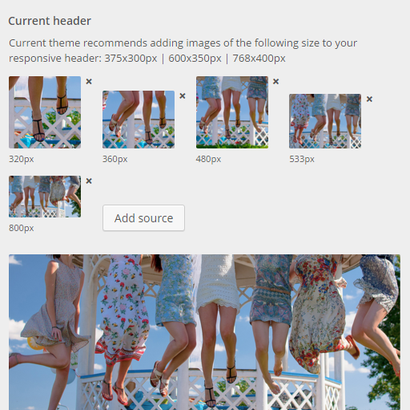

# RESPONSIVE CUSTOM HEADER
## up to WP 4.5.3
***
A set of custom functions making WordPress custom header image responsive. Handy when you develop a portfolio WP theme, or just need a better visual-per-device control.

It extends the WP customizer by the option to add image sources to header. A source of a desired or theme recommended size can be upload or picked up from media library and cropped (or not).

The assigned sources data then go into _img srcset_ tag at the header output. 

A [comprehensible article](https://jakearchibald.com/2015/anatomy-of-responsive-images/) on img srcset by a google guy.

*If you vote for CSS media queries to cover responsive-ness, simply use the responsive header data [getters](#getting-data) to get yourself the image source urls for CSS styling.*



***  
  
### MAKING IT WORK

1. Drop the _respHeader_ folder to the current theme root or whatever folder inside it. 

> If you drop the _respHeader_ folder into mu-plugins, move _index.php_ file from _respHeader_ to _mu-plugins_ and skip step 2.

2. Include _respHeader/index.php_ into themes's _function.php_
```
require_once get_stylesheet_directory() . '/respHeader/index.php';
```
3. Paste __respHeader()__ function to _header.php_ or wherever you need the header to show up.
4. Tada


### SOME CUSTOMIZING
* Replace _theme recommended_ source widths with those you find fit:

    * _index.php_ __add_srcset_theme_support()__ : 
    ```php
    add_theme_support( 'respHeader', array(
        array('width' => 320, 'height' => 200),
        array('width' => 375, 'height' => 300),
        array('width' => 600, 'height' => 350),
        array('width' => 768, 'height' => 400),
        'fallback' => 
            array('width'=> 412, 'height'=> 690)
        ));
    ```
> Add 'fallback' size to customize the default 320x320px. The fallback size is used after all recommended sources are added.

* Replace the default responsive header with very own default responsive header
    * Drop the images into the img folder
    * Replace the image url-s at: _index.php_ __add_srcset_theme_support()__ __$defaults__
    ```php
    'srcset' => array( // img sources
        array(
        'guid' => /respHeader/img/__ownSource__.jpg',
        'width'=> 320
        ),
    )
    ```

*** 

### <a name="getting-data"></a>GETTING DATA

All one needs for the custom header output - like _url, alt tags or image dimensions_ - can be gotten by the native or custom functions.

> HEADER SRCSET ARRAY|OBJ is stored:

* under the theme mod key _header\_image\_data_
* within the header _attachment metadata_ 

> The data is available with:

1. WP native __get\_theme\_mod( 'header_image_data' )__
2. WP native __wp\_get\_attachment\_metadata( $headerID )__
3. Responsive header _getter functions_

`get_header_srcset()` or 

`respHeader_data()` 


> Through all php functions as well as the object passed to js the data keeps the structure:

* [srcset]
    * width
    * height
    * guid
    * img\_id

***

### FILES

* _index.php_
    * Handles the responsive header theme support
    * Scripts loading
    * Files includes
* _\_custsomizer.php_
    * Adds the responsive header controls to the WP Customizer
    * Declares custom _resp\_Header\_Image_Control_ class, handling the header customizer interface
* _\_ajax.php
    * Handles adding, fetching to the customizer and removing the header srcset sources via the _wp\_ajax_ hooks
* _\_img.php
    * Getter and help functions
* _\_layout.php
    * Responsive header HTML output functions
* __js__
    * _respHeader.js_
        * Adds custom cropper to wp media uploader
        * Extends the native wp.Backbone.View that is in charge of the WP customizer current header template _wp.customize.HeaderTool.CurrentView_
* __sass__
* __css__
    * _respHeader\_back.css_, customizer styles
    * _respHeader\_front.css_, currently empty
* __img__, default images